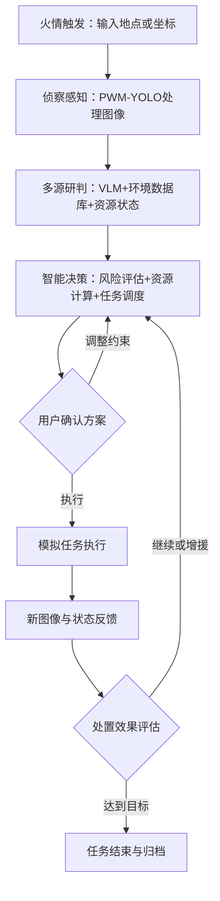

# 火巡智策——项目思路细化

> 来源：`思路细化.docx`  
> 定位：森林火情多源研判与无人机应急资源调度智能体。

## 1. 项目定位

构建一套可运行的：

```text
火情感知 → 环境研判 → 资源调度 → 方案确认 → 执行模拟 → 反馈重规划 → 结果归档
```

系统强调：数字由规则引擎和调度算法计算，智能体负责调用工具、组织顺序、处理分支并解释结论。

## 2. 完整业务流程



用户交互只发生在：

1. 发起火情任务；
2. 补充系统无法自动获得的信息；
3. 确认、拒绝或调整系统方案。

## 3. 自动获取与用户输入

| 信息 | 来源/交互方式 |
|---|---|
| 火灾地点、坐标 | 用户输入或预警系统传入 |
| 连续火情图像 | 真实侦察无人机回传；比赛中上传图片序列 |
| 火点、火焰、烟雾 | PWM-YOLO 自动识别 |
| 火势变化方向 | 连续图像变化 + 环境数据综合判断 |
| 风速、风向 | 优先读取场景数据库或传感器模拟数据 |
| 地形、地貌、海拔、水源 | 根据地点自动查询场景数据库 |
| 森林边界、道路、地图 | 地图数据库自动读取 |
| 无人机位置、电量、载荷 | 虚拟机群状态数据库自动读取 |
| 物资库存 | 系统库存数据库读取，也允许用户更新 |
| 是否存在人员 | 图像识别结果 + 用户确认 |
| 目标处置时限 | 用户可选输入 |
| 是否执行方案 | 用户最终确认 |

因此，系统的主要用户输入可以控制在：

- 火灾地点或坐标；
- 演示时上传的连续图像；
- 可选的目标处置时限；
- 可选的物资或设备限制；
- 是否执行、重新规划或终止任务。

这既保持自动化，也满足比赛对用户交互的要求。

## 4. 模块职责

### 4.1 PWM-YOLO

处理侦察图像并输出：

- 火点位置；
- 火焰/烟雾检测；
- 图像覆盖比例；
- 前后图像变化趋势；
- 置信度。

连续图像只能提供视觉趋势，不能可靠推导真实气象风速；数值风速由数据库或传感器提供。

### 4.2 VLM

VLM不直接计算无人机数量，负责：

- 理解火场图像；
- 结合YOLO结果解释火情；
- 判断人员、道路、建筑、障碍；
- 分析火势现象；
- 生成结构化火情描述；
- 发现冲突或异常。

### 4.3 环境数据库

地点输入后查询：

- 地形地貌、海拔、坡度；
- 森林边界；
- 水源位置与可用状态；
- 道路与疏散出口；
- 风速、风向。

竞赛 Demo 可先使用固定森林区域的 JSON/GeoJSON 数据库，证明按位置查询。

### 4.4 无人机资源

不能只固定三架，应建立 8 架虚拟无人机（可扩展为 6–9 架），按三个子群组织：

| 子群 | 编号/数量 | 核心职责 | 载荷与续航口径 |
|---|---|---|---|
| 侦察监测 | R1–R2 / 2 架 | 搜索、连续成像、火情定位、风向趋势、复核 | 载荷上限 2.5 kg，标准续航约 50 min；全程至少保持 1 架在线 |
| 灭火处置 | E1–E4 / 4 架 | 携带水剂或 CO₂ 模块，接近、定点处置、补喷 | 任务总载荷上限 25 kg；空载约 32 min，满载约 20–22 min |
| 综合支援 | S1–S2 / 2 架 | 通信、广播、疏散指引、物资/电池运输、后备监测 | 载荷上限 10 kg；空载约 60 min，满载约 40 min |

采用 2+4+2 而不是固定三架，是为了让系统根据火情决定出动数量。三个子群是角色层级，子群内部每架无人机都有独立状态。系统读取每架无人机的当前位置、电量、飞行速度、载荷上限、已携带物资、当前状态和可执行任务类型。支援子群的“充电”应实现为将备用电池或能源设备运送至补给点，或模拟设备返回补能，不描述普通无人机在空中直接给另一架无人机充电。

## 5. 智能体决策边界

| 决策 | 实现方式 |
|---|---|
| 当前风险等级 | 风险评分规则 |
| 火势发展方向 | 图像趋势+风向+地形 |
| 使用物资 | 火情类型+水源+库存规则 |
| 是否就近取水 | 水源距离、可用状态、任务时间 |
| 出动数量 | 需求、载荷、电量、距离约束 |
| 每架任务 | 约束筛选+任务分配 |
| 作业高度 | 场景参数+安全规则 |
| 是否人员疏导 | 人员检测+用户确认 |
| 疏散路线 | 火点、烟雾、道路、出口路径 |
| 是否完成 | 模拟处置能力与火势增长趋势比较 |
| 预计时间 | 仿真模型输出时间范围 |
| 无法完成的原因 | 物资、电量、数量、距离或火势约束 |
| 下一步动作 | 继续、增援、补给、返航、结束 |

大模型不直接猜关键数值。规则引擎负责计算，智能体负责：

- 调用工具；
- 组织顺序；
- 处理有人/无人和异常分支；
- 解释数字来源和约束。

## 6. 人员分支

确认有人时：

1. 识别/读取人员位置；
2. 将火点、烟雾扩散区设为风险区；
3. 读取道路和出口；
4. 规划避开风险区的路线；
5. 调用支援子群广播、照明、指引；
6. 将路线提交用户确认。

确认无人时，支援子群转为：

- 物资运输；
- 通信中继；
- 能源补给；
- 后备侦察；
- 增援待命。

## 7. 反馈闭环

采用5分钟离散轮次：

### 第一轮

读取首组图片和资源状态，生成方案，用户确认执行。

### 第二轮

读取5分钟后的新图片与状态，例如：火焰扩大、风向变化、电量下降、物资减少、新发现人员。

系统重新判断：

- 原方案是否有效；
- 是否追加物资；
- 是否更换无人机；
- 是否增援；
- 是否进入疏散分支；
- 是否结束任务。

最终输出：两轮对比、调度变更原因和任务总结。

## 8. 9月30日前范围

### 必须完成

- 地点输入；
- 连续图片上传；
- PWM-YOLO结果展示；
- 固定场景环境查询；
- 虚拟无人机和物资状态查询；
- VLM火情解释；
- 风险研判；
- 无人机数量与任务分配；
- 有人/无人分支；
- 用户确认执行；
- 第二轮反馈与重新规划；
- 自动生成最终报告。

### 可以简化

- 风速由场景数据库提供；
- 地图只做固定森林区域；
- 疏散路线使用小型网格；
- 悬停高度采用配置规则；
- 灭火时间输出估计区间；
- 执行过程用状态变化和地图动画模拟。

### 暂不实现

- 真实飞控；
- 真实空中补给；
- 全国 GIS；
- 连续实时视频流；
- 复杂三维火场仿真。

## 9. 交互原则与用户体验约束

用户不是向智能体描述一大段火情，而是输入地点、可选约束并确认方案。火情、环境和资源主要由系统自动采集，智能体负责综合研判和自主调度。

### 9.1 交互边界

- 首屏只要求地点或坐标；若由预警系统传入，则直接进入感知阶段。
- 连续图片是演示环境中的主要补充输入，上传后显示时间顺序和来源，不要求用户手工描述每一帧。
- 只有系统无法自动获得或置信度不足的信息才向用户追问，例如人员是否存在、目标时限、禁用设备和必须保留的资源。
- 系统生成方案后必须明确展示“待确认”，用户可以执行、拒绝、调整约束、重新规划或终止；生成方案本身不等于执行。
- 所有数字显示单位、数据来源和更新时间；演示位置没有 GPS 时必须标注为“演示位置”。
- 不以聊天文本替代结构化表单；关键选择使用枚举、开关、时间和数量控件，减少歧义。
- 危险或不可行方案必须说明触发的硬约束和资源缺口，不能用模糊措辞或虚假的确定完成时间掩盖不确定性。

### 9.2 结果呈现

方案卡片至少展示：风险等级、火情类型与 FLP、选中的 UAV 及子群、每架任务、药剂/水源、预计时间区间、人员分支、硬约束检查、备选方案、资源缺口和下一轮重规划触发条件。执行区展示当前状态、SOC、剩余药剂和库存；反馈区按轮次对比火情负荷、环境、资源变化及调度变更原因；归档区生成可追溯的任务报告。

## 10. 实现对应关系

| 思路模块/职责 | 后端实现对应 | 前端呈现/交互 | 规则边界 |
|---|---|---|---|
| 地点与场景输入 | `POST /api/analyze` / `POST /api/analyze/upload`（创建任务）、环境查询 service | 地点/坐标表单、场景来源 | 不传地点不能生成方案 |
| 图像感知 | PWM-YOLO 适配器、图片序列 Schema | 上传、缩略图、检测框和置信度 | 视觉结果不生成风速、真实面积或 SOC |
| VLM 解释 | 结构化分析 Skill/adapter | 火情摘要、冲突和异常提示 | 不直接决定数量、能耗、效果 |
| 环境研判 | environment service（`data/scene.json` + EnvironmentTool） | 风、坡度、水源、道路和来源标签 | 缺失值标记默认值并触发复核 |
| 资源与库存 | fleet/inventory store、确定性 Tools | 8 架状态、库存、锁定情况 | fault/低 SOC/超载不进入候选集 |
| 候选与评分 | candidate generation、constraint filtering、scoring | 主方案、备选方案、评分解释 | 先硬约束，后离散仿真和评分 |
| 有人/无人分支 | people assessment + support allocation | 人员状态选择、风险提示、路线确认 | 有人时保留通信和疏散保护资源 |
| 用户审批 | approval API 与任务状态机 | 确认/拒绝/调整/终止按钮 | 未确认不得进入执行状态 |
| 5 分钟闭环 | round API、1 分钟内部模拟 | 轮次对比、重规划原因 | 关键事件可提前触发重规划 |
| 报告归档 | report service / `dispatch_plan.json` | 下载或查看最终报告 | 保留输入、版本、事件和结论 |

建议将每个模块的输入输出固定为 JSON Schema，并在 Skill 编排层只传递结构化对象：感知模块输出 `fire_observation`，环境模块输出 `environment_snapshot`，资源模块输出 `fleet_snapshot`/`inventory_snapshot`，调度模块输出 `dispatch_plan`，执行模块输出 `round_result`。这样既便于替换真实模型，也避免同一数字在前端、Skill 和 pipeline 中重复计算。

## 11. 端到端演示顺序

1. 用户输入紫金山固定森林区域地点，系统加载环境、道路、水源和初始 2+4+2 资源。
2. 用户上传首组图片，PWM-YOLO 输出检测结果，VLM 形成结构化火情描述；系统标记人员为 confirmed、absent 或 unknown。
3. 规则引擎计算 FLP、增长率、SOC_need、物资需求和可行候选，生成主方案与备选方案。
4. 用户查看数字来源和约束，确认执行；系统锁定资源并记录审批事件。
5. 任务按 1 分钟推进，界面每 5 分钟展示一轮：火情负荷、SOC、药剂、库存和 UAV 状态。
6. 若风速升档、人员新发现、SOC 低于返航阈值或火情上升超过 20%，立即暂停原方案并生成新版本；否则继续执行。
7. 用户可确认增援/补给方案，或终止任务；达到控制目标后结束并归档两轮对比、调度变化和资源消耗。
